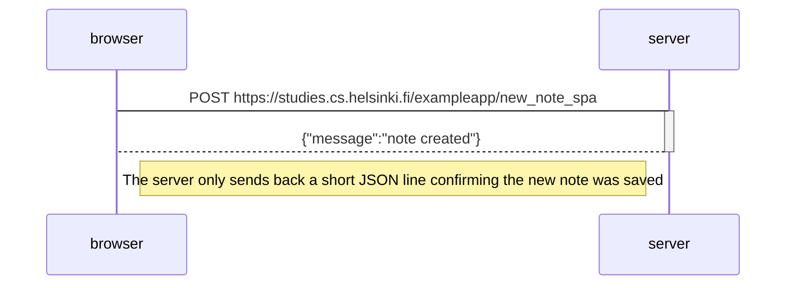

```mermaid
sequenceDiagram
    participant browser
    participant server

    browser->server: POST https://studies.cs.helsinki.fi/exampleapp/new_note_spa
    activate server
    server-->browser: {"message":"note created"}
    deactivate server

    Note left of server: The server only sends back a short JSON line confirming the new note was saved
```
