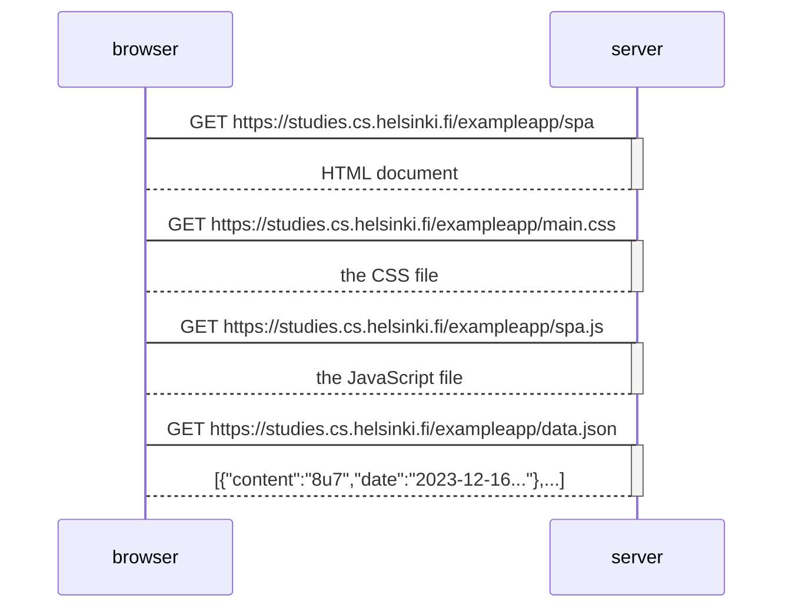

```mermaid
sequenceDiagram
    participant browser
    participant server

    browser->server: GET https://studies.cs.helsinki.fi/exampleapp/spa
    activate server
    server-->browser: HTML document
    deactivate server

    browser->server: GET https://studies.cs.helsinki.fi/exampleapp/main.css
    activate server
    server-->browser: the CSS file
    deactivate server

    browser->server: GET https://studies.cs.helsinki.fi/exampleapp/spa.js
    activate server
    server-->browser: the JavaScript file
    deactivate server

    browser->server: GET https://studies.cs.helsinki.fi/exampleapp/data.json
    activate server
    server-->browser: [{"content":"8u7","date":"2023-12-16..."},...]
    deactivate server
```
